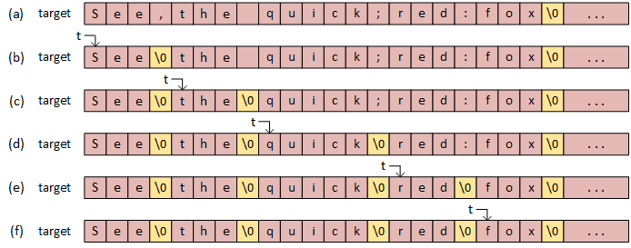

# Task076 — strtok 🔍

## В чем проблема

Вам дали строку. И теперь вы хотите разбить эту строку по конкретному символу разделителю на подстроки, чтобы дальше работать уже с ними.
Вы можете написать while цикл, который проходиться по строке и вытаскивает от туда подстроки рабитой строки, но это громоздко и не красиво. И тут на помощь к вам спешит `strtok`.

## Описание функции

Функция определена в `string.h`

Ее прототип:
```c
char * strtok( char * string, const char * delim );
```

Функция `strtok` выполняет поиск лексем (подстрок) в строке ***string***. Последовательность вызовов этой функции разбивают строку ***string*** на лексемы, которые представляют собой последовательности символов, разделенных символами разделителями.

На первый вызов, функция принимает строку ***string*** в качестве аргумента, чей первый символ используется в качестве начальной точки для поиска лексем. В последующие вызовы, функция ожидает нулевого NULL указателя и использует позицию сразу после окончания последней лексемы как новое местонахождение для сканирования.

Для определения начала лексемы функция сначала определяет символы, не содержащиеся в строке ***delim***, то есть они являются символами разделителями. А затем посимвольно проверяет остальную часть строки до первого символа-разделителя, который сигнализирует конец лексемы.

Этот конечный маркер автоматически заменяется нулевым символом, и лексема возвращается функцией. После этого, следующие вызовы функции strtok начинаются с этого нулевого символа.

> Внимание!
> Данная функция модифицирует строку, по которой проходиться. Имейте это в виду!

## Схематичное изображение происходящего



## Пример использования

```c
#include <stdio.h>
#include <string.h>
 
int main ()
{
    char myStr[] = "Hello my dear friend!";
    char * myPtr = strtok(myStr, " ");
    while(myPtr != NULL) {
        printf("%s\n", myPtr);
        myPtr = strtok(NULL, " ");
    }
}
```

Результат в консоли:
```
Hello
my
dear
friend!
```

----

## Задание

Напишите программу, которая как примере выше разделяет по словам следующее предложение:
"Как ты думаешь, кто победит: жаба, гадюка или истребитель пятого поколения F-35?"

Должно получиться так:
```
Как
ты
думаешь
кто
победит
жаба
гадюка
или
истребитель
пятого
поколения
F-35
```
