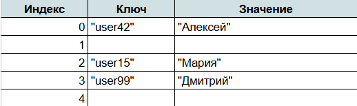

# Task078 — Хэш-таблица

## Описание

Представьте, что вам нужно мгновенно находить нужные данные среди миллионов записей — например, определять, есть ли пользователь в базе, или быстро подсчитывать количество посещений страницы. Обычный массив или список справится с этим за O(n), а хэш-таблица — за O(1) в среднем.

## Принцип хэширования: что такое хэш-функция и как она работает

Ключевая идея хэш-таблицы — преобразование ключа в индекс с помощью специальной функции, называемой хэш-функцией.

**Хэш-функция** — алгоритм, который берет входные данные (например, строку) и преобразует их в числовое значение фиксированной длины. Это значение называется **хэш**.

Пример работы хэш-функции:
```c
#define CAPACITY 50000 // Size of the Hash Table

unsigned long hash_function(char* str) {
    unsigned long i = 0;
    for (int j=0; str[j]; j++)
        i += str[j];
    return i % CAPACITY;
}
```

Данная хеш-функция основана на сложении значений ASCII символов строки, которая была передана в функцию. Значение делиться по модулю на размер будущей хэш-таблицы, чтобы мы не вышли за выделеную память под таблицу.
Функция супер простая и точно будет иметь колизии при использовании, но как начальный пример может сойти.

## Устройство хеш-таблицы

Хэш-таблицы устроены достаточно просто: в основе лежит массив, в котором хранятся пары ключ-значение. Именно эта структура данных позволяет использовать хэширование для быстрого доступа к элементам.

При работе с каждой хеш-таблицей приходиться использовать следующие определения:
- Ключ — уникальный идентификатор элемента, который передается в хэш-функцию.
- Значение — информация, привязанная к ключу (например, число, строка или объект).
- Хэш-функция — преобразует ключ в индекс массива, по которому будет храниться значение.

Представим, что у нас есть хэш-таблица на 5 ячеек:


Если мы захотим получить имя "user15", хэш-функция найдет индекс 2, и поиск займет O(1).

Использование массива позволяет быстро находить нужное значение. В отличие от списков, где поиск требует O(n) операций, в хэш-таблицах поиск идет за O(1) мгновенно.

## Основные операции с хэш-таблицами

Хэш-таблицы используют три основные операции:

    Вставка элемента (Insert). Добавление новой пары ключ-значение.

    Поиск элемента (Search). Доступ к значению по ключу.

    Удаление элемента (Delete). Удаление пары ключ-значение.

## Задание

Надеюсь, вы уже догадались, что именно вам предстоит сделать в данном задании...😏

Ваша задача: реализовать полноценную хеш-таблицу на языке C.

Она должна обладать базовыми методами для работы с ней (добавить элемент, найти его, удалить его). В качестве элементов будут C-строки.

Хеш-функция для простоты пускай будет та, что была приведена в самом начале. Но если у вас есть идея для более лучшей хеш-функции (а они точно есть), то дерзайте! Это будет только плюсиком для вас и вашей оценки.

Используйте сторонюю литературу и Интернет в целом (только не ИИшечку, прошу. Мы тут учится пришли, а не копипастом заниматься, ведь так?😥). При использовании стороннего кода изучите его, поймите его смысл и принцип работы.

Оставьте коментарии по коду, чтобы было легче объяснять, как работает ваша реализация хеш-таблицы.

Рабочей хеш-таблицей считается та таблица, которая может внести в себя пару случайных значений, может их выдать по ключу и может спокойно удалить из себя.